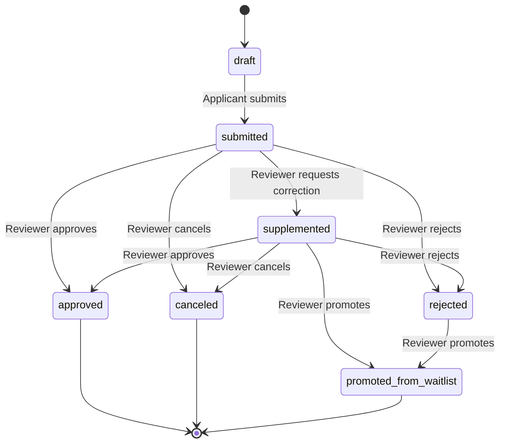
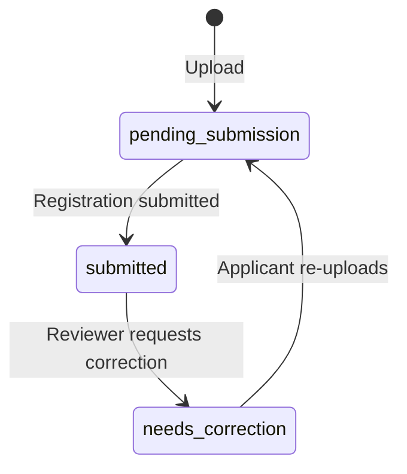

# System Design Document

## Activity Registration and Funding Audit Management Platform

---

## 1. System Overview

An integrated closed-loop management platform serving four user roles — **Applicant**, **Reviewer**, **Financial Administrator**, and **System Administrator** — for activity registration, checklist-based material submission, review workflow auditing, finance management, and operational compliance. Designed for pure offline deployment using Docker Compose with local PostgreSQL and local filesystem storage.

### 1.1 Design Goals

- **Offline-first:** Zero cloud dependencies. Local PostgreSQL, local file storage, no external auth providers.
- **Auditability:** Every state change is logged in both structured operational logs and persistent audit log records.
- **Security by default:** Argon2 password hashing, JWT hardening with auto-generated secrets, account lockout, role-based access control, sensitive field masking, log redaction.
- **Extensibility:** State machines defined as data (dictionaries), thresholds configurable via environment variables, similarity interface reserved but disabled.

---

## 2. High-Level Architecture

```
┌──────────────────────────────────────────────────────────┐
│                   Docker Compose                          │
│                                                          │
│  ┌──────────┐     ┌──────────────┐     ┌──────────────┐ │
│  │ postgres │────▶│   backend    │◀────│   frontend   │ │
│  │ :55432   │     │   :8000      │     │   :5173      │ │
│  │ (PG 16)  │     │  (FastAPI)   │     │ (Vue 3+Vite) │ │
│  └──────────┘     └──────────────┘     └──────────────┘ │
│        │                │                                │
│   [postgres_data]  [uploads_data]                        │
│                    [backups_data]                         │
└──────────────────────────────────────────────────────────┘
```

### 2.1 Technology Stack

| Layer | Technology | Purpose |
|---|---|---|
| Database | PostgreSQL 16 (Alpine) | Persistent storage, SQL dump for backup |
| Backend | Python 3.12, FastAPI, SQLAlchemy 2.0, Alembic | RESTful API, ORM, migrations |
| Authentication | Argon2 (pwdlib), JWT (python-jose) | Password hashing, token-based auth |
| Frontend | Vue 3, TypeScript, Vite, Element Plus, Pinia | SPA with component library |
| Infrastructure | Docker Compose | Orchestration with healthchecks |
| Scheduler | APScheduler | Periodic backup and metrics computation |

### 2.2 Backend Layering

```
backend/app/
├── api/routers/      # HTTP endpoints (15 routers)
├── api/deps.py       # Auth dependencies (get_current_user, require_roles)
├── core/             # Settings, security, exceptions, middleware, secrets
├── db/               # Session management, base model, seed data
├── models/           # SQLAlchemy ORM models (16 tables)
├── schemas/          # Pydantic request/response validation
├── services/         # Business logic layer
├── repositories/     # Data access patterns
├── storage/          # Local file storage + SHA-256 hashing
├── security/         # JWT decoder, config encryption
├── logging/          # JSON formatter, redaction
├── jobs/             # APScheduler periodic tasks
├── utils/            # Masking utilities
└── workflows/        # Workflow definitions
```

### 2.3 Frontend Structure

```
frontend/src/
├── views/            # 7 page-level components
│   ├── LoginView           # Two-panel auth page
│   ├── DashboardView       # Role-based KPI overview
│   ├── ApplicantWizardView # 3-step registration wizard
│   ├── ReviewerQueueView   # Queue with batch review
│   ├── FinanceManagementView # Accounts, transactions, overspend dialog
│   ├── AdminSettingsView   # Backup, alerts, exports, policy
│   └── AuditLogsView       # Access audit trail viewer
├── layouts/AppShell.vue    # Sidebar + topbar shell
├── router/           # Role-aware route guards
├── stores/auth.ts    # Pinia auth state + JWT storage
├── api/              # Axios HTTP client + endpoint wrappers
├── styles/theme.css  # Design system (CSS custom properties)
└── utils/notify.ts   # Toast notification helpers
```

---

## 3. Data Model

### 3.1 Entity Relationship Summary

```
User (1) ──────────< RegistrationForm (N)
                           │
                           ├──< RegistrationMaterialSubmission (N)
                           │          │
                           │          └──< MaterialVersion (max 3)
                           │
                           ├──< ReviewWorkflowRecord (N)
                           │
                           ├──< SupplementarySubmissionRecord (0..1)
                           │
                           └──< QualityValidationResult (N)

MaterialChecklist (1) ──< MaterialChecklistItem (N)

FundingAccount (1) ──< FundingTransaction (N)

Standalone: AuditLog, AlertRecord, LoginAttemptLog,
            BackupRecord, DataCollectionBatch,
            CollectionWhitelistPolicy
```

### 3.2 Core Tables

#### users
| Column | Type | Constraints | Description |
|---|---|---|---|
| id | INTEGER | PK | Auto-increment ID |
| username | VARCHAR(64) | UNIQUE, NOT NULL, indexed | Login username |
| full_name | VARCHAR(128) | NOT NULL | Display name |
| password_hash | VARCHAR(255) | NOT NULL | Argon2 hash |
| role | ENUM | NOT NULL, indexed | `applicant`, `reviewer`, `financial_admin`, `system_admin` |
| is_active | BOOLEAN | NOT NULL, default=true | Soft disable |
| failed_attempt_count | INTEGER | NOT NULL, default=0 | Lockout counter |
| first_failed_attempt_at | TIMESTAMPTZ | nullable | Lockout window start |
| locked_until | TIMESTAMPTZ | nullable | Lock expiry time |
| created_at / updated_at | TIMESTAMPTZ | NOT NULL | Timestamps |

#### registration_forms
| Column | Type | Constraints | Description |
|---|---|---|---|
| id | INTEGER | PK | Auto-increment ID |
| applicant_id | INTEGER | FK→users, NOT NULL, indexed | Owner |
| title | VARCHAR(200) | NOT NULL | Registration title |
| description | TEXT | NOT NULL | Details |
| contact_phone | VARCHAR(32) | NOT NULL | Sensitive — masked for non-owners |
| id_number | VARCHAR(32) | NOT NULL | Sensitive — masked for non-owners |
| deadline_at | TIMESTAMPTZ | nullable | Auto-lock trigger |
| submitted_at | TIMESTAMPTZ | nullable | Submission timestamp |
| is_locked | BOOLEAN | NOT NULL, default=false | Deadline lock flag |
| status | ENUM | NOT NULL, default=`draft` | State machine status |
| created_at / updated_at | TIMESTAMPTZ | NOT NULL | Timestamps |

#### material_checklists / material_checklist_items
Defines the global checklist template. Each item has `item_code`, `item_name`, `required` flag, and `max_size_mb` per-file limit.

#### registration_material_submissions
Junction table linking a registration to a checklist item. Tracks `total_size_bytes` and `is_locked`.

#### material_versions
| Column | Type | Constraints | Description |
|---|---|---|---|
| id | INTEGER | PK | Auto-increment |
| submission_id | INTEGER | FK→submissions, indexed | Parent submission |
| version_number | INTEGER | NOT NULL | 1, 2, or 3 (max 3) |
| status | ENUM | NOT NULL, default=`pending_submission` | `pending_submission`, `submitted`, `needs_correction` |
| original_filename | VARCHAR(255) | NOT NULL | User's filename |
| stored_filename | VARCHAR(255) | UNIQUE, NOT NULL | Server-side storage name |
| file_extension | VARCHAR(16) | NOT NULL | `.pdf`, `.jpg`, `.png` |
| sha256_hash | VARCHAR(64) | NOT NULL, indexed | Duplicate detection fingerprint |
| file_size_bytes | BIGINT | NOT NULL | Size for quota tracking |
| uploaded_by | INTEGER | FK→users | Uploader |

#### review_workflow_records
Immutable append-only log of all state transitions: `from_status`, `to_status`, `comment`, `reviewer_id`, `batch_ref`.

#### supplementary_submission_records
One-time correction window per registration: `reason`, `expires_at` (72h from opening), `consumed` flag.

#### funding_accounts
Budget containers: `account_name` (unique), `category`, `period`, `budget_amount` (NUMERIC 14,2).

#### funding_transactions
| Column | Type | Constraints | Description |
|---|---|---|---|
| id | INTEGER | PK | Auto-increment |
| funding_account_id | INTEGER | FK→accounts, indexed | Parent account |
| transaction_type | ENUM | NOT NULL, indexed | `income`, `expense` |
| amount | NUMERIC(14,2) | NOT NULL | Transaction amount |
| transaction_time | TIMESTAMPTZ | NOT NULL, indexed | Business time |
| category | VARCHAR(64) | NOT NULL, indexed | Expense category |
| invoice_original_filename | VARCHAR(255) | nullable | Attached invoice name |
| invoice_stored_filename | VARCHAR(255) | nullable | Server-side invoice path |
| invoice_sha256 | VARCHAR(64) | nullable | Invoice file hash |
| operator_id | INTEGER | FK→users | Actor |

#### Supporting Tables
- **audit_logs**: `actor_user_id`, `action`, `target_type`, `target_id`, `details`, `created_at`
- **alert_records**: `alert_type`, `severity` (info/warning/critical), `message`, `is_resolved`
- **login_attempt_logs**: `username`, `user_id`, `success`, `reason`, `ip_address`, `user_agent`
- **quality_validation_results**: `registration_form_id`, `approval_rate`, `correction_rate`, `overspending_rate`
- **data_collection_batches**: `batch_code`, `description`, `created_by`
- **backup_records**: `backup_type`, `file_path`, `file_sha256`, `file_size_bytes`, `status`
- **collection_whitelist_policies**: `policy_name`, `scope_rule`

---

## 4. Business Logic Design

### 4.1 Registration State Machine



**Transition Rules:**
- Transitions validated against `ALLOWED_TRANSITIONS` dictionary at service layer.
- `comment` is mandatory for `rejected`, `supplemented`, and `canceled` transitions.
- Transitioning to `supplemented` unlocks the registration and marks latest material versions as `needs_correction`.
- Invalid transitions return HTTP 400.

### 4.2 Material Status Lifecycle



**Rules:**
- Max 3 versions per checklist item per registration.
- File types restricted to PDF/JPG/PNG.
- Single file ≤ 20MB; total per registration ≤ 200MB.
- SHA-256 hash computed on upload; duplicate detection via hash index lookup.
- Materials auto-lock when registration `deadline_at` passes.

### 4.3 Overspend Control Flow

```
[User creates expense transaction]
        │
        ▼
[Calculate: current_total + amount > budget × 1.10?]
        │
    ┌───┴───┐
    │ No    │ Yes
    │       │
    ▼       ▼
 [Save]  [overspend_confirmed == true?]
              │
          ┌───┴───┐
          │ No    │ Yes
          │       │
          ▼       ▼
       [409]   [Save + Alert]
```

- First attempt without confirmation returns HTTP 409 with warning message.
- Frontend shows modal dialog; retry with `overspend_confirmed=true`.
- On confirmed overspend, creates `AlertRecord` with severity `WARNING`.

### 4.4 Account Lockout Flow

```
[Login attempt with wrong password]
        │
        ▼
[Within 5-minute window from first_failed_attempt_at?]
        │
    ┌───┴───┐
    │ No    │ Yes
    │       │
    ▼       ▼
[Reset    [Increment failed_attempt_count]
 counter       │
 to 1]      [count >= 10?]
              │
          ┌───┴───┐
          │ No    │ Yes
          ▼       ▼
        [Wait]  [Set locked_until = now + 30min]
```

- Each attempt logged in `login_attempt_logs` with IP address and user agent.
- Successful login resets counter, clears `locked_until`.
- Admin can unlock via `POST /api/admin/unlock-user`.

### 4.5 Supplementary Submission

- One-time per registration; enforced by checking existing `SupplementarySubmissionRecord`.
- 72-hour window: measured from the `created_at` of the latest `ReviewWorkflowRecord` transitioning to `supplemented` or `rejected`.
- Opens the registration lock (`is_locked = false`) and sets status to `supplemented`.
- Records `reason`, `expires_at`, `requested_by`.

### 4.6 Batch Review

- Maximum 50 registrations per batch (enforced at service layer and frontend).
- Single `comment` and `target_status` applied to all selected registrations.
- Each transition creates its own `ReviewWorkflowRecord` with shared `batch_ref` identifier.

---

## 5. Security Design

### 5.1 Authentication

| Mechanism | Implementation |
|---|---|
| Password hashing | Argon2 via `pwdlib.PasswordHash.recommended()` |
| Token format | JWT (HS256) with `sub` (user ID), `role`, `exp`, `iat`, `type` |
| Token lifetime | Configurable, default 120 minutes |
| Secret management | Auto-generated 512-bit secret, persisted at `jwt_secret.key` with `0600` permissions; weak/default values rejected at startup |

### 5.2 Authorization

| Layer | Mechanism |
|---|---|
| Route-level | `require_roles({...})` FastAPI dependency on every protected endpoint |
| Object-level | `assert_registration_actor_access()` checks `applicant_id == actor.id` for applicant role; reviewers/admins pass through |
| Frontend | Vue Router `beforeEach` guard checks `localStorage` token + role against route `meta.roles` |
| Navigation | AppShell sidebar items filtered by current user role |

### 5.3 Data Protection

| Feature | Implementation |
|---|---|
| Sensitive field masking | `mask_id_number()` → `AB****12`; `mask_contact()` → `123*****90`; applied in API responses for non-owner/non-admin viewers |
| Log redaction | 12+ sensitive keys (`password`, `token`, `id_number`, `contact_phone`, etc.) replaced with `***REDACTED***` in JSON log output |
| Config encryption | `encrypt_config_value()` / `decrypt_config_value()` using Fernet symmetric encryption |
| Backup safety | `_validate_tar_members()` rejects absolute paths, traversal paths, and symlinks before extraction |

### 5.4 Audit Trail

- `AuditLog` table records: actor, action, target type/ID, details, timestamp.
- Events logged: login, registration CRUD, submission, workflow transitions, material uploads/status changes, finance transactions, backup/recovery, admin operations.
- Structured JSON operational logs with `category` (operational/security/business), `channel` (log level), `event` name, `request_id`.

---

## 6. API Design

### 6.1 Router Organization

| Router | Prefix | Roles | Purpose |
|---|---|---|---|
| health | `/api/health` | Public | Service healthcheck |
| auth | `/api/auth` | Public + Authenticated | Login, profile |
| registrations | `/api/registrations` | Applicant, Reviewer, Admin | CRUD, submit, supplementary |
| checklists | `/api/checklists` | Applicant, Admin | List checklist templates |
| materials | `/api/materials` | Applicant, Reviewer, Admin | Upload, list, status change |
| workflows | `/api/workflows` | Reviewer, Admin (+Applicant for history) | Queue, transition, batch, history |
| finance | `/api/finance` | Financial Admin, Admin | Accounts, transactions, stats |
| metrics | `/api/metrics` | Reviewer, Admin | Recompute quality metrics |
| alerts | `/api/alerts` | Admin | List, resolve alerts |
| reports | `/api/reports` | Various (role-gated) | CSV exports (4 types) |
| backups | `/api/backups` | Admin | Create, list, recover |
| similarity | `/api/similarity` | Admin | Reserved (disabled by default) |
| admin | `/api/admin` | Admin | Settings, policies, user management, secure config |
| audit | `/api/audit` | Reviewer, Admin | Audit log listing |
| dashboard | `/api/dashboard` | All authenticated | Dashboard data |

### 6.2 Response Format

All API responses follow a consistent envelope:

```json
{
  "code": 200,
  "msg": "Description of result",
  "data": { ... }
}
```

Error responses use the same structure with appropriate HTTP status codes (400, 401, 403, 404, 409, 422, 500).

### 6.3 Error Handling

Three exception handler layers in `main.py`:
1. **`APIError`** → business-level errors with specific status codes and messages.
2. **`RequestValidationError`** → Pydantic validation failures (422).
3. **`Exception`** → catch-all for unhandled errors (500), logged with `log_error`.

---

## 7. Frontend Design

### 7.1 Design System

CSS custom properties define a cohesive visual language:

| Token | Value | Usage |
|---|---|---|
| `--bg-base` | `#f3f5f9` | Page background |
| `--bg-gradient` | Dual radial gradients | Background texture |
| `--brand` | `#1f6feb` | Primary action color |
| `--surface` | `#ffffff` | Card backgrounds |
| `--border` | `#dfe5f2` | Element borders |
| `--shadow-soft` | `0 10px 35px rgba(...)` | Card elevation |
| `--radius-lg/md/sm` | 16/12/10px | Corner rounding |

Interactive feedback: button hover `translateY(-1px)`, surface hover `translateY(-2px)` with shadow amplification, page-in fade animation.

### 7.2 Responsive Breakpoints

| Breakpoint | Behavior |
|---|---|
| ≤ 1200px | Sidebar narrows to 210px |
| ≤ 980px | Sidebar collapses to horizontal navigation bar (sticky top) |
| ≤ 900px | Batch panel stacks vertically |
| ≤ 768px | Page container padding reduces; grid collapses to single column |

### 7.3 Role-Based Navigation

The `AppShell.vue` layout filters navigation items by `user_role` from `localStorage`. The Vue Router `beforeEach` guard redirects unauthorized role access to `/dashboard`.

| Route | Allowed Roles |
|---|---|
| `/dashboard` | All authenticated |
| `/applicant/wizard` | applicant, system_admin |
| `/reviewer/queue` | reviewer, system_admin |
| `/finance/management` | financial_admin, system_admin |
| `/admin/settings` | system_admin |
| `/audit/logs` | reviewer, system_admin |

---

## 8. Operational Design

### 8.1 Startup Sequence

1. PostgreSQL starts with healthcheck (`pg_isready`).
2. Backend waits for PostgreSQL health (`wait_for_postgres.sh`).
3. Alembic runs `upgrade head` for migrations.
4. `seed_initial_data(db)` creates default users and checklist idempotently.
5. APScheduler starts periodic jobs (daily backup, metrics recomputation).
6. Uvicorn starts serving on port 8000.
7. Frontend Vite dev server starts on port 5173.

### 8.2 Backup and Recovery

- **Create:** `POST /api/backups/create` → PostgreSQL `pg_dump` + `tar.gz` of uploaded files → stored in backups volume.
- **List:** `GET /api/backups` → all backup records from database.
- **Recover:** `POST /api/backups/{id}/recover` → validates tar members (safety), extracts SQL dump, applies via `psql`, restores uploaded files.
- **Scheduled:** APScheduler triggers daily automatic backup.

### 8.3 Logging Architecture

```
[Request] → [Middleware: request_logging_middleware]
                │
                ├─── [JsonFormatter] → stdout (JSON per line)
                │         │
                │         ├─ timestamp, level, channel, logger
                │         ├─ category (operational/security/business)
                │         ├─ event name, request_id
                │         └─ context (auto-redacted sensitive fields)
                │
                └─── [Level routing]
                       ├─ status ≥ 500 → ERROR
                       ├─ status ≥ 400 or elapsed ≥ 2s → WARNING
                       └─ otherwise → INFO
```

### 8.4 Metrics and Alerting

Quality metrics computed on demand or periodically:
- **Approval rate:** fraction of registrations approved.
- **Correction rate:** fraction requiring correction.
- **Overspending rate:** fraction of accounts exceeding budget.

Thresholds configurable via environment variables:
- `alert_approval_rate_min = 0.4`
- `alert_correction_rate_max = 0.5`
- `alert_overspending_rate_max = 0.2`

When thresholds are breached, `AlertRecord` entries are created with appropriate severity levels.

---

## 9. Deployment

### 9.1 Docker Compose Services

| Service | Image | Ports | Volumes | Healthcheck |
|---|---|---|---|---|
| postgres | postgres:16-alpine | 55432:5432 | postgres_data | `pg_isready` |
| backend | Custom (Dockerfile) | 8000:8000 | uploads_data, backups_data | `curl /api/health` |
| frontend | Custom (Dockerfile) | 5173:5173 | — | — |

### 9.2 Environment Configuration

All settings configurable via environment variables with sensible defaults:

| Variable | Default | Description |
|---|---|---|
| `DATABASE_URL` | `postgresql+psycopg://...@postgres:5432/activity_audit` | Database connection |
| `JWT_SECRET_KEY` | (auto-generated) | JWT signing secret |
| `JWT_ACCESS_TOKEN_EXPIRE_MINUTES` | 120 | Token TTL |
| `APP_ENV` | development | Environment indicator |
| `UPLOADS_DIR` | /app/uploads | File storage path |
| `BACKUPS_DIR` | /app/backups | Backup storage path |

### 9.3 Data Persistence

Three named Docker volumes ensure data survives container restarts:
- `postgres_data` — PostgreSQL data files
- `uploads_data` — Uploaded materials and invoices
- `backups_data` — Backup archives and reports

---

## 10. Design Decisions and Trade-offs

| Decision | Rationale | Trade-off |
|---|---|---|
| SQLite for unit tests | Fast, no DB server needed for CI | Minor behavioral differences vs. PostgreSQL |
| Per-account lockout (not per-IP) | Simpler for offline deployment, no Redis needed | IP-level rate limiting requires reverse proxy |
| Single comment for batch review | UX simplicity; individual comments available via single transitions | Less granularity per item in batch |
| No soft-delete for business entities | Compliance focus — data should never be deleted | No "undo delete" UX needed |
| JWT in localStorage | Simple SPA integration | XSS vulnerability surface (mitigated by same-origin policy) |
| Finance accounts globally accessible to all financial_admins | Flat role model matches prompt description | No per-account ownership isolation |
| Similarity interface reserved but disabled | Meets requirement without external dependencies | Placeholder returns empty results |
